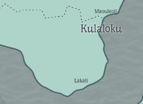

- 
- A city in Puanaukia Province in Naleania, with a population of just over 12 thousand. It is neighbors to the capital city of Kulaloku (pop. 37k) which gives it a similar level of comfort at a lower price. It is famously the home of the #Witch of the #West, and her [[Azure Atelier]]. A seaside town with a harbor filled with fishing boats.