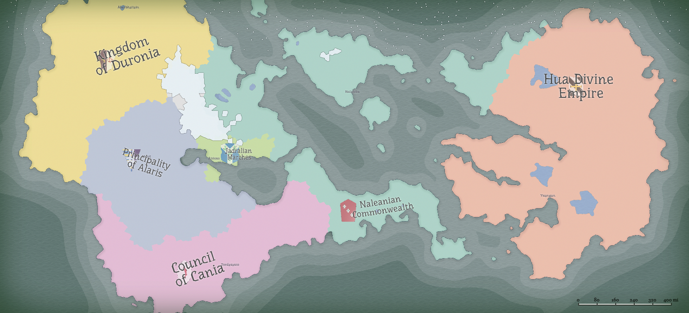

- 
- Nations of Llethis:
	- [[Hua Divine Empire]]: A theocracy that unifies the Eastern region. Primarily #Lu peoples.
	- [[Naleanian Commonwealth]]: The naval nation that completely dominates oceanic trade. Primarily #Denathan.
	- [[Jadralian Marches]]: A vassal state of the Commonwealth. #Astellian people who submitted to the growing naval empire. Serves as a buffer state between the Commonwealth and the Principality.
	- [[Principality of Alaris]]: Penned in by neighboring states, Alaris allies itself with Naleania in order to keep Cania in check. Primarily #Astellian people.
	- [[Council of Cania]]: A communist nation established relatively recently following a revolution. The rapid spread of Canian ideas raised great alarm in surrounding nations. It has made enemies of every nation in the #West. Primarily #Astellian people.
	- [[Kingdom of Duronia]]: A relatively barren northland inhabited by the elusive [[Eos Sithe]]. Allies with its closest neighbor, Alaris, and unlikely allies with the Hua.