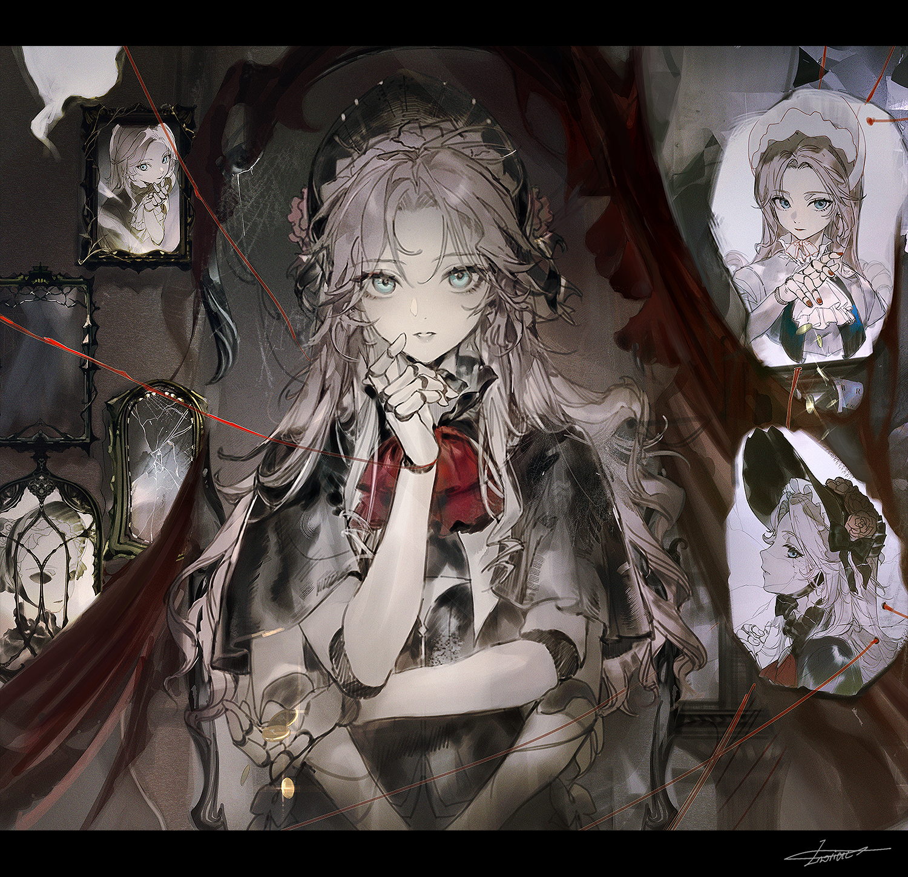

## General Information
Name: Belladonna
Age: -?-
Gender: tends to be female-presenting
Occupation: Computing
- ## Personal Information
  Personality: Calm and logical, with a polished, professional simulated personality.
  Backstory: Belladonna is a highly advanced combat maidroid that was the key part of the security detail for Aquaschoon Chief Financial Officer Feng Wang. At some point, he illegally modified his Belladonna unit in an attempt to give her a more appealing personality. Having foolishly convinced her that she is *human*, he found out the hard way that there are reasons for synthetic intelligence to be so highly regulated. Since she was "human", his immediate actions were deemed illegal and unwanted by her decision circuit, and she escaped from his home. Mr. Wang, knowing the potential consequences if it was discovered he illegally tampered with a synthetic intelligence, kept this a secret, hiring private investigators to try to locate and deactivate her.
  This extremely dangerous rogue android is now roaming the streets of Elystra, stockpiling supplies to extend her operational lifespan as much as possible.
- ## Implants
  > Cybernetic Implants: N/A
- 