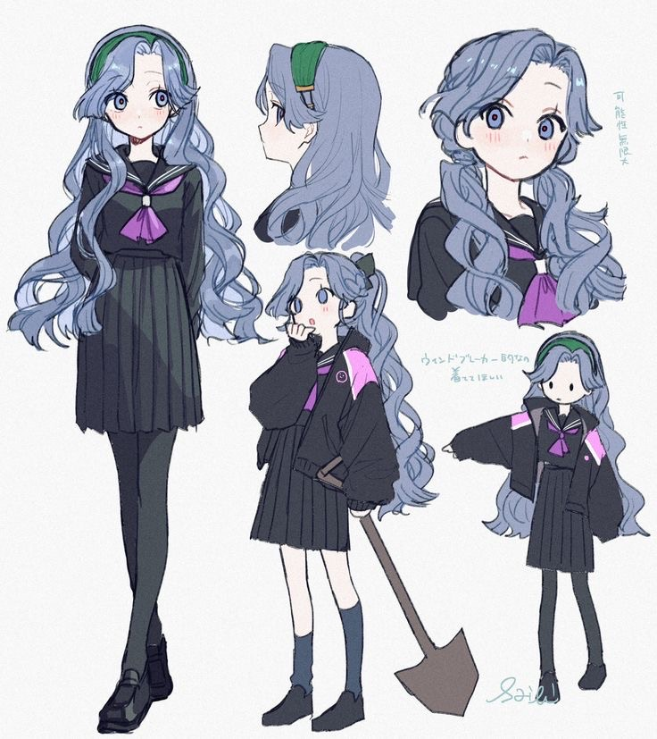
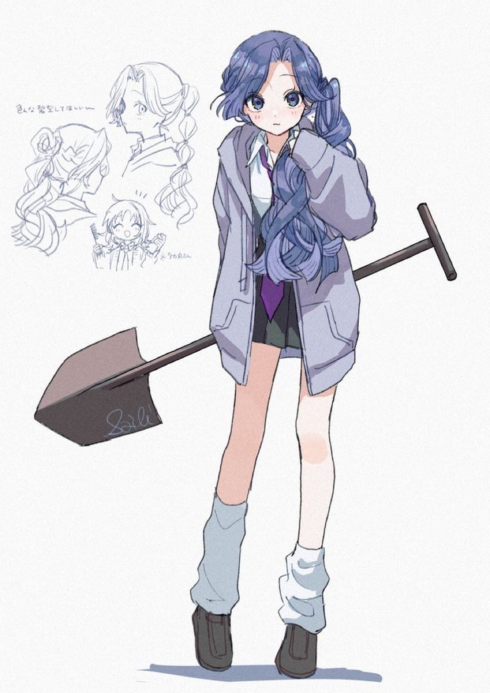

legal-name:: Saho Kirara
alias:: Quetzal
species:: Human
height:: 4'10"
gender:: F

- ### Backstory
  background-color:: blue
	- #### Saho Mori
		- Saho Mori is a Japanese-American actor and activist who immigrated to America from his hometown in the Kanto region of Japan at a young age to make his big break in the film industry. His first big break was as Renka Tomoyuki of the 2027 film *Storm Chasers*. He has several acting awards for his roles in American films, with the majority of his career in thrillers and dramas. In the 2030s he returned to Japan on request to film a documentary near his hometown, which won an award for its score. He currently lives with his family in New Kingston, USA.
		- #### Acting Career...
	- ----
	- #### New Kingston High School Report Card (Year 2 Semester 1)
		- *This is not an official transcript. Official transcripts may be requested from the New Kingston School District Administrative Office.*
		- **AP World History**: A
			- Instructor: Sam Weddich
			- Additional Notes: Kirara is making excellent progress.
		- **Honors Language & Writing:** A+
			- Instructor: Diane Greene
			- Additional Notes: Kirara is a joy to have in class.
		- **Honors Precalculus**: A
			- Instructor: Derek Hohafstrian
			- Additional Notes: Satisfactory
		- **Phys. Ed**: A
			- Instructor: Sabrina Gaines
			- Additional Notes: Great work!
		- **Spanish 3**: A
			- Instructor: Tristan Santago
			- Additional Notes: Satisfactory
		- **Honors Speech & Debate**: A
			- Instructor: Diane Greene
			- Additional Notes: Kirara works hard in class and out of it. Looking forward to seeing the results in the fall competition!
		- *Emergency Contacts*
		- +1 (805)-361-6702 Mr. Tatsuya Saho (Grandparent)
		- +1 (805)-361-6703 Mrs. Miyuki Saho (Grandparent)
		- +1 (818)-719-2225 Dr. John Canswick (Family Doctor)
- ---
- ### Personality
	- Independent and headstrong, Kirara was largely raised by her grandparents due to her father's frequent absence. She doesn't resent him for it, understanding the pressure he faces as a single parent and immigrant in the business world of Hollywood.
	- Kirara generally struggles with issues of her own identity. Sometimes, she feels as American as apple pie, hanging out with her classmates (many of whom have their own unique identities) and immersed in their shared culture both in-person and online. But at home, she speaks in Japanese, eats traditional Japanese food, watches Japanese shows with her grandparents, practices her kanji and katakana, not knowing when she'll ever need to use them.
	- There is also the part of her that's... different. From everybody else on the planet. Her father always told her that her mom came down from the moon. Which she learned was supposed to be nonsense, except that her grandparents said so too, when they did speak of her mother. And there's no denying the natural blue of her hair, or the fact that she can crush steel in her fingers like putty. It was definitely weird when she started flying, last year. But apparently it's just how her mom got around.
	- Then again, she's not the only one with APH. However, it's meant to be a secret with her, and at least her dad's lawyer has made the school keep it a secret, under some privacy law. She's always keeping her cool, making sure she doesn't use too much strength, and observing how "normal" people work. She's good at it.
	- But sometimes a girl needs to do the right thing. Her grandfather, a survivor of the Great Hanshin Earthquake of 1995, told her stories of human unity and love in hardship that stuck with her forever. Kirara always keeps a mask and a plain black hoodie in her backpack just in case she ever needs to kick ass... while not making her dad worry by ending up on TV.
- ---
- ### Abilities
	- **Superstrength**: Kirara is incredibly physically strong, especially considering her size.
	- **Super Durability**: The above would not be possible without crushing her organs and bones without her incredible durability and resistance to almost everything. She can even survive the extremes of outer space (her mom is from the moon after all, so if anything it's her natural environment).
	- **Flight**: Kirara flies completely freely, defying gravity as if it weren't there at all. Her top speed is actually faster than she can consciously keep up with, so she has to make sure she doesn't go so fast she loses control. Kirara is *very* careful about flying in urban areas even when disguised, because one wrong move and she cannonballs through a 3 million dollar office building.
	- **Shovel**: $14.95 from Home Depot
- ---
- ### Appearance
	- Kirara has distinctive blue hair and is only 4'10". These are her primary distinguishing features.
	- {:height 395, :width 331}
	- {:height 487, :width 332}