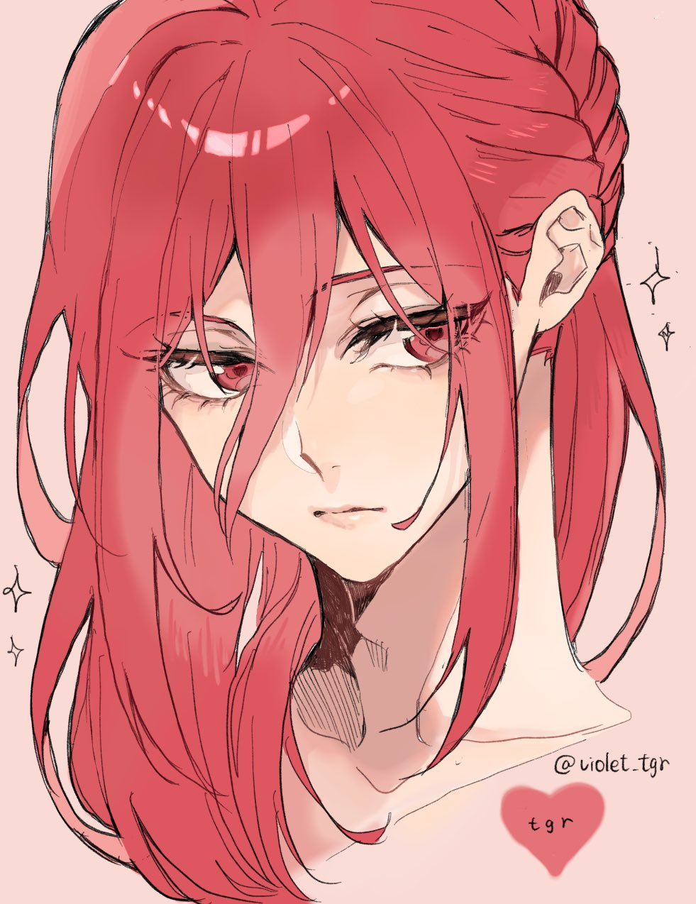

- **Rowan Soraya**
- **Age** 22
- **Species** Human
- **Personality** She appears reserved, but is actually quite fierce and very reliable. While she doesn't really like the sound of her own voice, her expressions tell most of what she wants to say anyways.
- **Hobbies** Dressmaking and sewing are her hobbies. Traditional embroidery is her talent.
- **Skills** Her swordsmanship is exquisite, she can cook, clean, and take care of herself. She's not very good at small talk, but she does make an effort.
- **Job** Wandering swordsman, knight errant, ronin, sellsword, whatever you want to call it. Muscle for hire, she specializes in whatever puts food on the table.
- **Likes** She loves pretty things and pretty sights, often deliberately taking time out of her day to admire them.
- **Goals** She's looking for a place to call home. And her father, but that's less important.
- **Potion Toxicity** 0
- {:height 347, :width 250}
- **Magic**
	- Her family is the last remaining trace of a long line of warriors. They possess extremely pure qi circulation techniques, and one of these is Rowan's *Yin Occultation*. The user replaces all the yang qi in their body with yin qi. This is done by harvesting it from the environment, usually in the form of moonlight. Being deeply connected to yin energy, the wielders are significantly more powerful whenever surrounded by it, such as at night. Their attacks bear traces of an extreme cold, though this is mostly wasted energy, and an experienced user minimizes this effect.
	- Rowan's use of it is a little different from her ancestors, however. Rather than moonlight, her original vast supply of yang energy has been replaced with the bloodtwine and yin qi of an elder being. These and other factors make her perfectly suited to the Yin Occultation technique. While she has the potential to become a swordsmaster like the stories of old, for now, she's simply a prodigy with the blade.
- **Backstory**
	- *A Story from the Seaside*
		- There is a little village on the coast of Alvirda named *Verdes Cove*. Like any of its neighbors, it lives off of fishing and a little farming. The villagers had a quaint local religion. To them, god was a many-armed creature that resides under the sea. If you arrived at the right season, you might've caught a festival to the god.
		- In the distant past, on the darkest night of the year, drawn by a song they could not hear, the chosen youths would step into the waves, taken by god. Terrified of their deity, the people consulted a witch, who gave them a sword and a prophecy. If they gave their bravest son to the god, it would spare their daughters. If they gave their fairest daughter to the god, it would spare their sons.
		- So each year on the winter solstice, the people selected the most beautiful maiden of the village. She was their sacrifice to god, and they adorned her in flowers and purest white. In one hand she held a rose, in the other a sword, and she descended into the water to slay their god. She does not return.
		- So it had been for generation after generation. Rowan's grandmother, and mother, were taken by god. But Rowan was born a man, and the year she came of age, there were no maidens left to take part in the sacrifice. The village elders despaired, knowing that if they had no daughters to give, god would take their sons. The fearful fled, the stubborn stayed. On that darkest night, Rowan donned her mother's dress, took up her father's sword, and plucked the lantern from her home's doorway. She'd known in her heart of hearts since long ago that she was a daughter of the village, and she would protect them.
		- She saw it then, her god, rising out of the waters. Eight great limbs it had, its body misshapen. When it fixed its eyes on her, she felt its cruel intelligence. It stared at her the way you would stare at an ant, unimaginable colors flickering over its body which was both fluid and rigid under a thick layer of mud. Living corals adorned it like a crown, their polyps reaching out into the air in a desperate, dying bloom. Tears of blood ran down her face, her mortal eyes unable to bear its existence.
		- But she was a warrior's daughter, and she splashed the lantern-oil over her sword, thrusting the burning blade into god's body. Its blood and qi coated her, burning and freezing. And so the prophecy was made complete. The village had given their bravest son and their fairest daughter at once, and so god spared their sons and their daughters with its death.
		- These days, the little fishing village doesn't worship any gods. Their daughters play without fear of being named the "fairest". Some speak of the apparition that plagued their homes as a demon, others believe it a monster. A true god, after all, could never be slain. But there is a little graveyard overlooking the seaside, remembering all the women who walked into the night and never came back.
	- Rowan left Verdes Cove shortly after she slew the being that had terrorized it for so long. Although she loved her home, it wasn't a place where she could be comfortable being herself. She had also discovered the demon's qi had mixed its way deep into her body, and needed time to adjust.
	- Since then, she's simply wandered around. She had a brief stint as a sword dancer with a performing troupe, worked a few times as a merchant's escort, and even got involved in a mercenary expedition. Four years later, she has arrived in a small valley in the mountains with a trader's group.